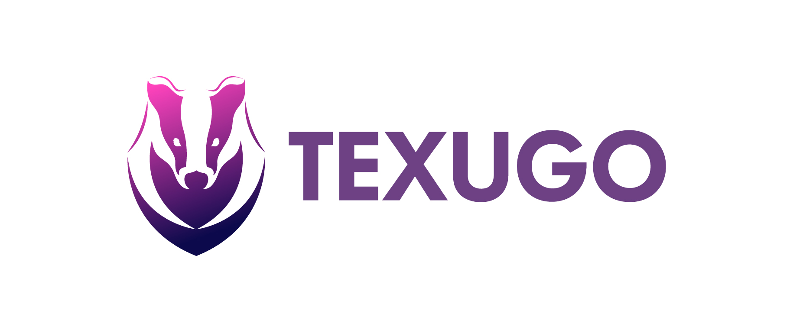

# Texugo



[](https://www.codacy.com/manual/leozz37/texugo?utm_source=github.com&amp;utm_medium=referral&amp;utm_content=leozz37/texugo&amp;utm_campaign=Badge_Grade)
[](https://www.codefactor.io/repository/github/leozz37/texugo)
[](https://travis-ci.com/leozz37/texugo)
[](https://ci.appveyor.com/project/leozz37/texugo)
[](https://codecov.io/gh/leozz37/texugo)
[](https://codedocs.xyz/leozz37/texugo/)
[](https://opensource.org/licenses/MIT)

Texugo is a flexible multiplatform server message switch using Modern C++ based on Boost Asio.

## Features

-   End-to-end system that process messages, using [Boost.ASIO](https://www.boost.org/doc/libs/1_66_0/doc/html/boost_asio.html);
-   Flexible port binding;
-   Reliably serve devices across multiple networks;
-   Logging support with [spdlog](https://github.com/gabime/spdlog);
-   Unit tests using [Catch2](https://github.com/catchorg/Catch20);
-   Support to build and run the binary on [Docker](https://www.docker.com/);
-   Support to docker-compose to run all the services dependencies;
-   TODO: Storing messages and logs on [MongoDB](https://www.mongodb.com/);
-   TODO: Metrics monitoring with [Prometheus](https://prometheus.io/);
-   TODO: Data visualization with [Grafana](https://grafana.com/);

## Installation

Follow these steps:

### Clone this repository

```bash
$ git clone https://github.com/leozz37/texugo.git
```

### Create a build directory and build binary

```bash
$ mkdir build && cd build

$ cmake ..

$ make -j4
```

### Running Tests

```bash
$ cd build/tests

$ ctest -V
```

## Docker

Building the image:

```bash
$ docker build . -t texugo
```

Running the image:

```bash
$ docker run -v $PWD/..:/dev/texugo texugo
```

Running docker compose

```bash
$ docker-compose up
```

## Server Configs

You can change the default route settings by changing the _routingAddresses_ array on the resources/settings.json file.

```JSON

"routingAddresses": [
    {
      "AAAAAAA": "3000"
    },
    {
      "BBBBBBB": "3001"
    },
    {
      "CCCCCCC": "3002"
    },
    {
      "DDDDDDD": "3003"
    },
    {
      "EEEEEEE": "3004"
    }
  ]
```
